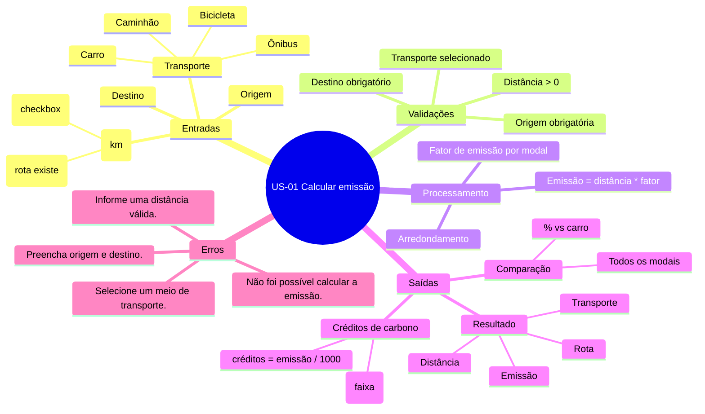

# Mind-map — US-01 (Calcular emissão de CO2 da viagem)

Abaixo um mind-map (formato Mermaid) para a User Story **US-01**.

```mermaid
mindmap
  root((US-01 Calcular emissão))
    Entradas
      Origem
      Destino
      Distância (km)
        Automática (rota existe)
        Manual (checkbox)
      Transporte
        Bicicleta
        Carro
        Ônibus
        Caminhão
    Validações
      Origem obrigatória
      Destino obrigatório
      Distância > 0
      Transporte selecionado
    Processamento
      Fator de emissão por modal
      Emissão = distância * fator
      Arredondamento
    Saídas
      Resultado
        Rota
        Distância
        Emissão
        Transporte
      Comparação
        Todos os modais
        % vs carro
      Créditos de carbono
        créditos = emissão / 1000
        preço estimado (faixa)
    Erros
      Preencha origem e destino.
      Informe uma distância válida.
      Selecione um meio de transporte.
      Não foi possível calcular a emissão.
```
